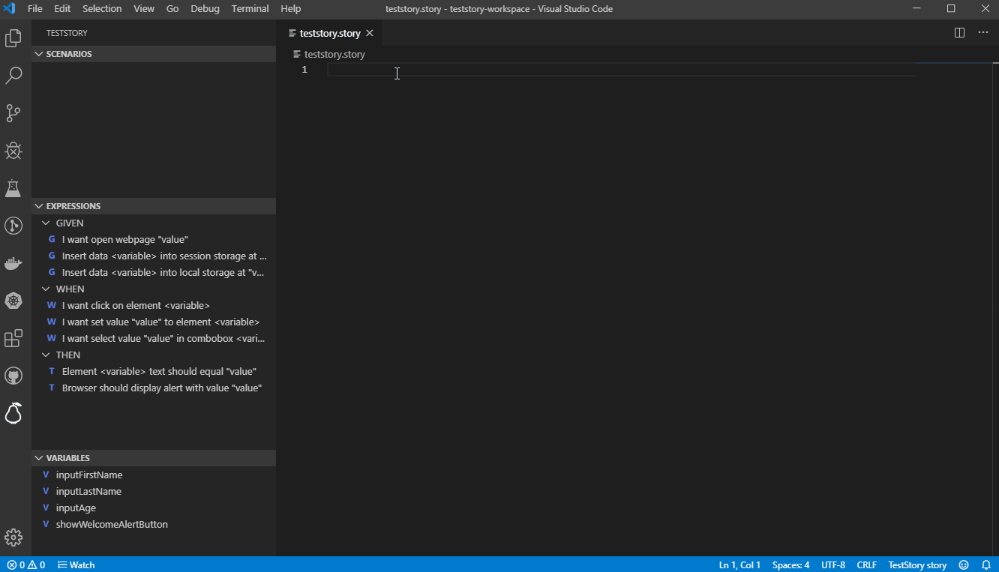
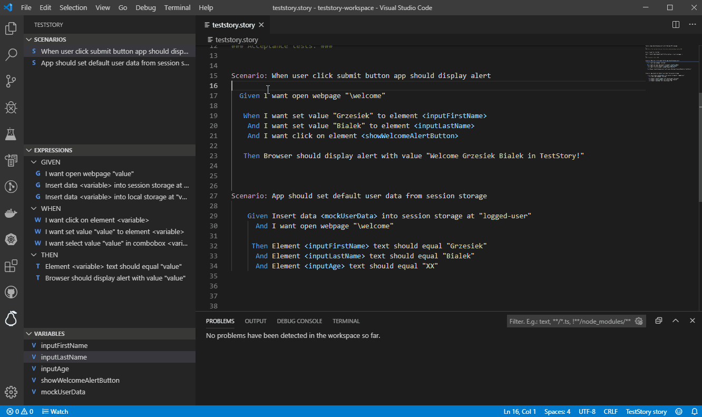
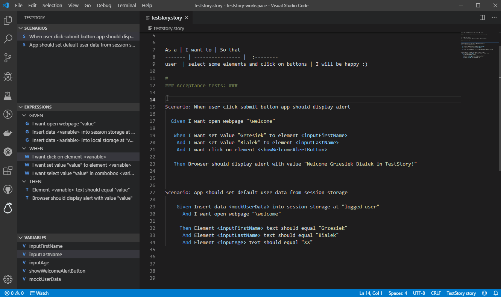
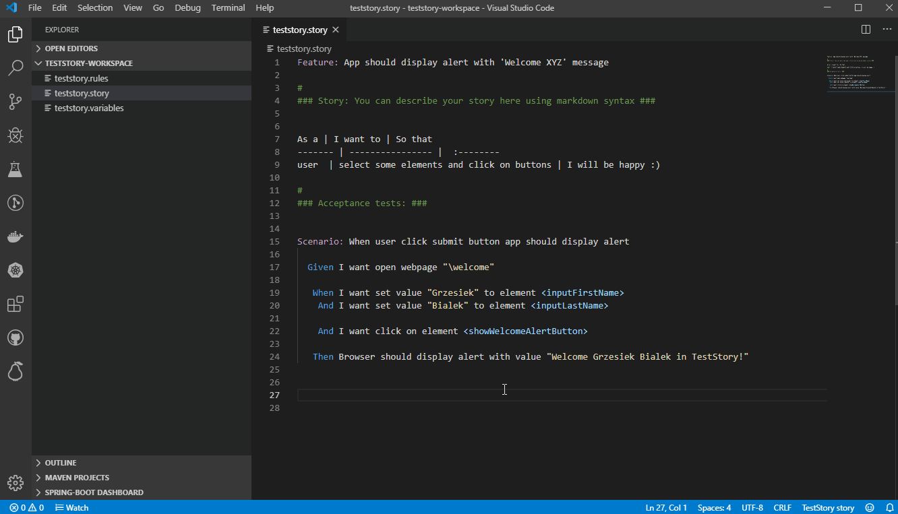
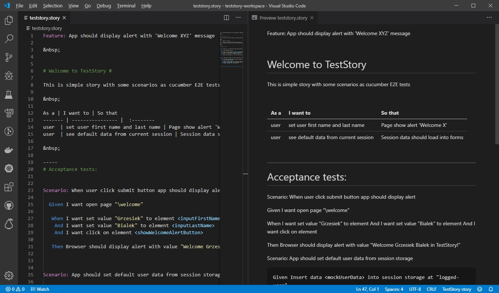

# TestStory
## VSC Editior for scrum stories with acceptance criteria as e2e tests

&nbsp;

## Declarative IntelliSense 
You can write tests using declarations of rules and variable before developers create real application code. 

## Quick fix errors in E2E tests
Editor supports rich error diagnostics to help write bug free tests

## Navigation
Fast navigation between stories and declaration of rules and variables

## Perspective
Own perspective with all stories, rules and variables

## Story as documentation
Editor support markdown grammar 

## Build project
How to build and contribute to this project

- Run `npm install` in terminal to install dependencies
- Run `npm run grammar-variables` to generate ANTLR grammar for variables files
- Run `npm run grammar-rules` to generate ANTLR grammar for rules files
- Run `npm run grammar-story` to generate ANTLR grammar for story files
- Run the `Run Extension` target in the Debug View. This will:
	- Start a task `npm: watch` to compile the code
	- Run the extension in a new VS Code window